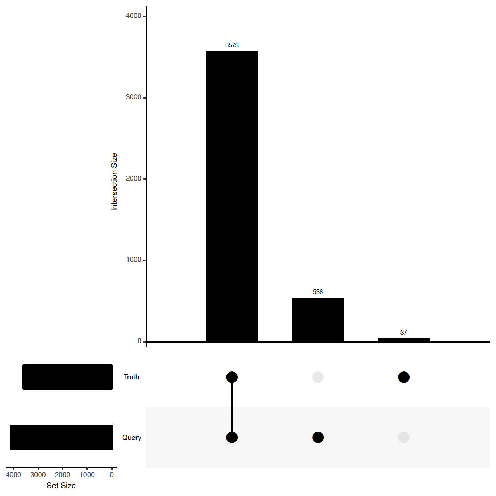

# VCFCompare
A Python program for evaluating site-level concordance of a query VCF against a truth VCF.

 The summary metric CSV file contains:
* Variant type: SNV or INDEL
* Total number of variants in the truth and query VCF files
* Total true-positive, false-positive, and false-negative calls
* Recall and Precision

## Usage
This tool compares two variant callsets against each other and produces a CSV file with summary metrics.

In the following examples, we assume that the code has been installed to the directory `${VCFCompare}`.

```bash
#option 1 (default): look at both SNV and INDEL concordance
$ python3 ${VCFCompare}/src/python/VCFCompare.py \
      example/gatk_variants.vcf \
      example/bcftools_variants.vcf \
      -out test
$ ls test.*
test.csv

#option 2 (optional): look at either SNV or INDEL concordance
$ python3 ${VCFCompare}/src/python/VCFCompare.py \
      example/gatk_variants.vcf \
      example/bcftools_variants.vcf \
      -out test \
      --type SNV (or INDEL)
$ ls test.*
test.SNV.csv (or test.INDEL.csv)
```

The example above compares an example run of GATK 4.1.0.0 against an example run of bcftools 1.9 on the same random sample.

The summary metric CSV file contains:

Type | TRUTH.TOTAL | TP | FP | FN | QUERY.TOTAL | Recall | Precision
--- | --- | --- | --- | --- | --- | --- | ---
SNV | 3610 | 3573 | 538 | 37 | 4111 | 0.989750693 | 0.869131598
INDEL | 205 | 104 | 101 | 101 | 247 | 0.507317073 | 0.421052632

## Upset Plots
If you want to visualize the difference and intersection between the truth and query VCF files, you can use the upset.R script under src/R/
The upset.R script runs on a set of VCFCompare.py results produced with the -o flag, as shown in the example above

```bash
$ Rscript ${VCFCompare}/src/R/upset.R \
      -i test.csv \
      -o TestRun
$ ls TestRun.*
TestRun.INDEL.pdf  TestRun.SNV.pdf
```
This will produce two PDF files: one for SNVs and one for INDELs.
Below is a screenshot for SNVs


